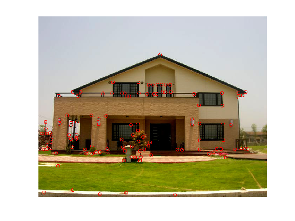

 
(Left: originla image. Right: image overlap with corners.)

# Project 2: Image Filtering and Corner Detection

## Brief
* Required files: many original images and their overlaid corners, and MyHarrisCornerDetector.m

##Overview
The goal of this homework is to use image filter to calculate image gradients.
Then, we combine image gradients and apply Gaussian filter to compute second moment matrix at each pixel location.
Next, we can compute the corner response function described in our lecture note.
Finally, we apply a threshold and non-maximum suppression to obtain distinctive corner locations.

## Credits
	Assignment modified by Min Sun and James Chan based on A. Ganoun's open source example.
