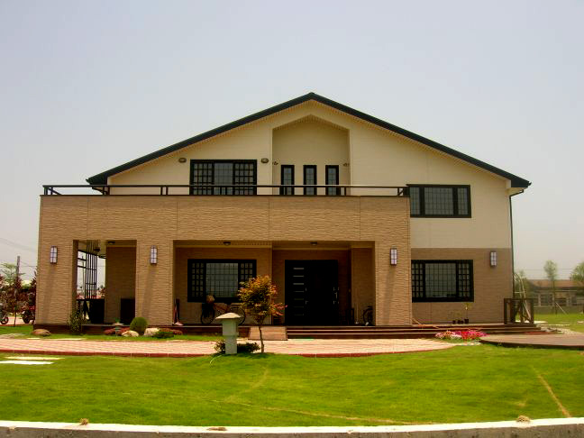
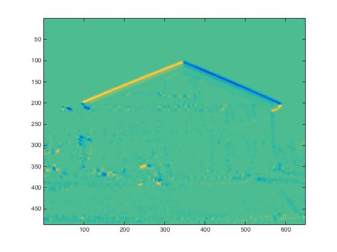
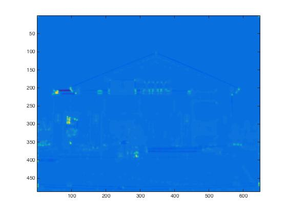
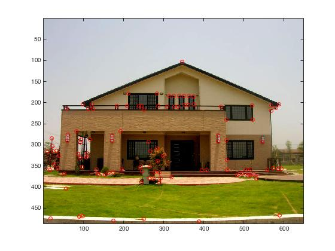

# 張植鈞 <span style="color:red">(student ID: 102061214)</span>

# Project 2: Image Filtering and Corner Detection

## Overview
The goal of this project is to implement my own Harris corner detector by Matlab. First, we use image filter to calculate the gradients of image on x and y directions. Then, we apply Gaussian filter as the window funcion to compute second moment matrix at each pixel location. Next, we can compute the corner response function R. At last, we perform non-maximum suppression to get the points of local maxima, and then obtain distinctive corner locations.

## Implementation
1. Create My Own Function(MyHarrisCornerDetector.m)

Steps:

* 1. Calculate the image gradients:

First, change the input image to grayscale, and then calculate the gradients.

```
dx = [-1 0 1; -1 0 1; -1 0 1];
dy = dx'; 
Ix = conv2(I, dx, 'same');
Iy = conv2(I, dy, 'same');
```

* 2. Second Moment Matrix M:

Calculate the Ix^2, Iy^2, Ixy by applying  Gaussian filter to compute second moment matrix M.

```
Ix2 = conv2(Ix.^2, g, 'same');
Iy2 = conv2(Iy.^2, g, 'same');
Ixy = conv2(Ix.*Iy, g, 'same');
M = [[Ix2 Ixy];[Iyx Iy2]];
```


* 3. Corner Response Function R:

Calculate the det(M) and trace(M) to acquire the R, and then make R value range from 0 to 1000.

```
det = (Ix2.*Iy2) - Ixy.^2;
trace =Ix2 + Iy2;
R = det - alpha*(trace).^2;
R=(1000/max(max(R)))*R;
```

* 4. Get the Corners in the image:

Use ordfilt2()to implement maximun filter and find the local maximum which is larger than the threshold. Note that we have to avoid the image edge.

## Installation
* How to compile from source?

Compile and run MyHarrisCornerDetector.m

### Results

The following images represent the input image, Ixy, R value, and the output.

<table border=1>
<tr>
<td>




</td>
</tr>
</table>
